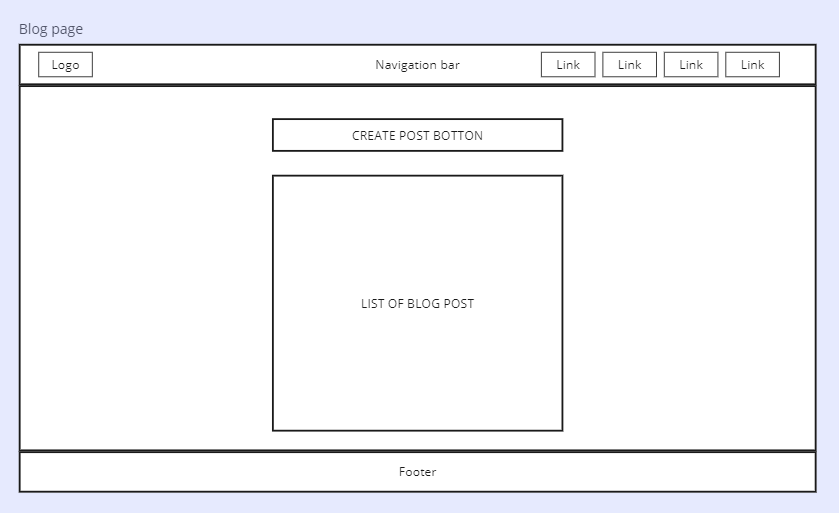
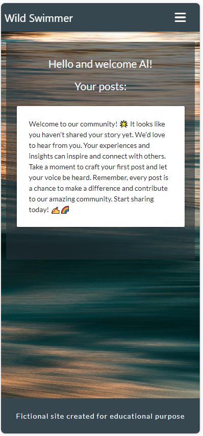

# **Project Overview**

[Wild Swimming](https://flask-wild-swimming-1dc7d2b9c0b6.herokuapp.com/home) This fictional website was built for educational purposes as part of Miles Stone Project 3 at/for the Code Institute 4_P course. It's a full-stack website focusing on HTML, CSS, Python, Flask, and MongoDB technologies.
The fictional project is a  Wild Swimming platform for outdoor swimming lovers. The site is intended to provide information about swimming and allow users to share experiences and connect with others. <br>
 
 
<br>

# Table of contents
* [Project Overview](#project-overview)
    * [Wild Swimming](#wild-swimming)
    * [Table of contents](#table-of-contents)
* [Project Planning](#project-planning)
    * [Target Audiences](#target-audiences)
    * [Website business goals](#website-business-goals)
    * [User Stories](#user-stories)
    * [Agile development](#agile-development)
    * [Minimally viable product (MVP) for the project submission](#minimally-viable-product-mvp-for-the-project-submission)
    * [Wireframes](#wireframes)
    * [Database](#database)
    * [Suggested future improvements](#suggested-future-improvements)
    * [Website colour palette](#website-colour-palette)
    * [Typography](#typography)
* [Main Features](#main-features)
    * [Navigation bar](#navigation-bar)
    * [Footer](#footer)
    * [Home Page Overview](#home-page-overview)
    * [Blog Page Overview](#blog-page-overview)
    * [Profile Page Overview](#profile-page-overview)
    * [Create Post Page Overview](#create-post-page-overview)
    * [Login Page Overview](#login-page-overview)
    * [Register Page Overview](#register-page-overview)
    * [Other Website Functionality Overview](#other-website-functionality-overview)
* [Technology](#technology)
    * [Python Modules used](#python-modules-used)
* [Testing](#testing)
* [Bugs](#bugs)
    * [Bugs Report Table](#bugs-report-table)
* [Deployment](#deployment)
    * [Deployment to Heroku](#deployment-to-heroku)
    * [Forking the GitHub Repository](#forking-the-github-repository)
    * [Making a Local Clone](#making-a-local-clone)
    * [Create non-relational database](#create-non-relational-database)
* [Version Control](#version-control)
* [Credits](#credits)
    * [Website resources](#website-resources)
    * [Website development](#website-development)
    * [Personal appreciation](#personal-appreciation)

## Project Planning

### Target Audiences
This platform is tailored for outdoor swimming enthusiasts of all levels, from beginners to seasoned adventurers. It's for anyone who enjoys exploring natural waters, discovering new swim spots, and embracing the thrill of wild swimming. For people seeking safety tips, eager to share swimming experiences, or simply looking to connect with a passionate community that shares a love for outdoor swimming, the platform is to support and inspire your aquatic adventures.
<br>

### Website business goals
- User Engagement
- Community Growth
- Monetization
- Brand Partnerships
- Event promotion and participation
- Email marketing to subscribed users
- Social media presence
- Education and safety impact/content delivery

### User Stories

| Issue ID | User Story |
|----------|------------|
| [#1](https://github.com/AleksandrAtr/wildswimming-ms3/issues/1) | As a first-time visitor, I want to see a list of available blogs on the platform to explore content. |
| [#2](https://github.com/AleksandrAtr/wildswimming-ms3/issues/2) | As a first-time visitor, I want to read full blog posts to understand their content and the topics covered. |
| [#3](https://github.com/AleksandrAtr/wildswimming-ms3/issues/3) | As a first-time visitor, if I find the platform interesting, I want an easy and intuitive process to register for an account. |
| [#4](https://github.com/AleksandrAtr/wildswimming-ms3/issues/4) | As a first-time visitor, I want to learn about the concept of wild swimming and its significance within the community. |
| [#5](https://github.com/AleksandrAtr/wildswimming-ms3/issues/5) | As a first-time visitor, I want information about various wild swimming spots—such as rivers, lakes, or coastlines—and their suitability for swimming. |
| [#6](https://github.com/AleksandrAtr/wildswimming-ms3/issues/6) | As a first-time visitor, I need access to safety tips, guidelines, or resources related to wild swimming to ensure a secure and enjoyable experience. |
| [#7](https://github.com/AleksandrAtr/wildswimming-ms3/issues/7) | As a first-time visitor, I want to know how to connect with the wild swimming community - be it through forums, groups, or events - to learn more and interact with fellow enthusiasts. |
| [#8](https://github.com/AleksandrAtr/wildswimming-ms3/issues/8) | As a first-time visitor, provide resources like recommended gear, techniques, or articles specific to wild swimming for beginners. |
| [#9](https://github.com/AleksandrAtr/wildswimming-ms3/issues/9) | As a registered user, I want to engage in discussions, share experiences, or ask questions in forums or dedicated community spaces. |
| [#10](https://github.com/AleksandrAtr/wildswimming-ms3/issues/10) | As a registered user, I want to log into my account securely using my credentials. |
| [#11](https://github.com/AleksandrAtr/wildswimming-ms3/issues/11) | As a registered user, I want to create new blog posts, including adding text, images, and formatting the content. |
| [#12](https://github.com/AleksandrAtr/wildswimming-ms3/issues/12) | As a registered user, I want the ability to edit my existing blog posts to update or refine the content. |
| [#13](https://github.com/AleksandrAtr/wildswimming-ms3/issues/13) | As a registered user, I want the option to delete my blog posts that are no longer relevant or needed. |
| [#14](https://github.com/AleksandrAtr/wildswimming-ms3/issues/14) | As a registered user, I want to see a list of the blog posts I've authored for easy access. |
| [#15](https://github.com/AleksandrAtr/wildswimming-ms3/issues/15) | As a registered user, I want to securely log out of my account to ensure privacy and security. |
| [#16](https://github.com/AleksandrAtr/wildswimming-ms3/issues/16) | As a registered user, I want to engage in discussions, share experiences, or ask questions in forums or dedicated community spaces. |
| [#17](https://github.com/AleksandrAtr/wildswimming-ms3/issues/17) | As a registered user, I want the ability to create and promote events like group swims or meetups to gather fellow wild swimming enthusiasts. |
| [#18](https://github.com/AleksandrAtr/wildswimming-ms3/issues/18) | As a registered user, I want an opportunity to connect with experienced swimmers or experts for advice or guidance on advanced techniques, safety measures, or environmental concerns. |
| [#19](https://github.com/AleksandrAtr/wildswimming-ms3/issues/19) | As an admin, I want to review, edit, or delete user-generated content (blog posts, comments) that violate community guidelines or are inappropriate. |
| [#20](https://github.com/AleksandrAtr/wildswimming-ms3/issues/20) | As an admin, I want to create, update, and delete user accounts. |
| [#21](https://github.com/AleksandrAtr/wildswimming-ms3/issues/21) | As an admin, I want to disable or suspend user accounts for policy violations or inactivity. |
| [#22](https://github.com/AleksandrAtr/wildswimming-ms3/issues/22) | As an admin, I want access to a dashboard displaying key platform metrics, user statistics, and activity summaries. |
| [#23](https://github.com/AleksandrAtr/wildswimming-ms3/issues/23) | As an admin, I want to organize or categorize blog posts into specific topics, tags, or categories. |
| [#24](https://github.com/AleksandrAtr/wildswimming-ms3/issues/24) | As an admin, I want to manage access permissions for different user roles (e.g., moderator, editor). |

### Agile development
User stories have been created in the GitHub Projects - links to the stories are provided in the [User Stories](#user-stories) table in the Issue ID column. The user stories have been split into categories using the MoSCoW prioritization method -
- Must-have
- Should-have 
- Could-have

The primary goal for the MVP was to concentrate on the development of essential features (Must-have items). The Should-have and Could-have shall be addressed in the future development cycles.

The procedural steps during development were as follows:

1. Transfer a crucial user story from the Sprint Backlog (User Stories) column to the To Do (User Story) column.
1. Based on the user story, generate tasks related to its fulfilment and store them in the To-do (Tasks and Spikes) column. Subsequently, break down each task into sub-tasks and document them on the task card.
1. Prepare multiple tasks and initiate their implementation. The one currently in progress is shifted to the In Progress (Tasks and Spikes) column. Mark off completed sub-tasks and document any issues or progress comments.
1. Upon task completion, relocate it to the Done (Tasks and Spikes) column and close it, providing comments if necessary.
1. Once all tasks associated with the user story are finished, move the user story to the Done (User Stories) column, including any pertinent comments.
1. Repeat the process until the project phase completion. 

This methodology centred on developing essential features first, enabling flexibility, and allowing incremental development. The approach incorporated transparent progress tracking through visual boards and early identification of issues. 

The details of the user stories and associated priority labels can be found in [Projects](https://github.com/users/AleksandrAtr/projects/2/views/3?filterQuery=-status%3A%22Awaiting+Review+%28Tasks+and+Spikes%29%22).

Screenshot of the board -
<br>
 

<br>

### Minimally viable product (MVP) for the project submission
#### Unregistered users
- Home page
- Blog Page
- Login
- Register

#### Registered users
- Home page
- Blog Page
- Profile
- Create Post
- Logout

### Wireframes
#### High level website design desktop - 
<br>
 

<br>


<br>


<br>


<br>


<br>


<br>


<br>

#### High-level website design for mobile - 

<br>

#### High-level webpage flow chart - 

<br>

### Database
A database schema was created based on the user stories during the planning stage. For the scheme development, a non-relational database, MongoDB, was used.

#### High-level database schema - 

<br>

### Suggested future improvements
For future implementations, refer to the Should & Could Have items in the User Stories in the GitHub projects. [Take me to the Agile development section](#agile-development).

### Website colour palette
The colour scheme represented the natural elements of wild swimming, such as open bodies of water, riverbanks, rocks, tree trunks, and sunset/sunrise water reflections. 

by [coolars](https://coolors.co/
)
### Typography
For the website design, several fonts are used:

- All links and buttons are set to "Roboto", part of the sons-serif family. The font was chosen following research on the most readable font family for buttons and labels.
- All paragraph, headings, spans text uses Lato Google font, a part of the sans-serif family that provides a clean, modern look.

## Main Features
At the MVP stage, the website has two layouts:
- Users not logged in can see - Home, Blog, Login, and Register
- Logged-in users can see - Home, Blog, Profile, Create Post, and Logout
<br>

The layout of the pages is consistent throughout and includes:
- A navigation bar.
- A website's main section.
- A footer.

The navigation bar and footer repeat on all pages. 

The design is responsive on all pages, providing usability on different screen size devices.

### Navigation bar
It is built to give users easy and consistent website page access. The active page is highlighted to provide current page feedback.

The Navigation bar consists of the following:
- Business logo
- Links to the website pages
<br>
#### Desktop view

<br>
#### Mobile view

<br>
#### Mobile view - expanded

<br>

### Footer
The footer's position is at the bottom of the screen. It provides a placeholder for future features.

#### Typical view

<br>

### Home Page Overview
The home page is structured with user-friendly components, including a navigation bar for seamless navigation, a captivating hero image, an informative section with additional site details, and a concluding footer.

#### Key Components:
- Navigation Bar: Facilitates easy navigation throughout the website.
- Hero Image: Captivates users with visually appealing content.
- Additional Site Information Section: Offers further insights into the nature of the website.
- Footer: Concludes the home page, providing additional information and links.
<br>

#### The home page serves a dual purpose:

- Informative Content: Communicates the essence of the website to users.
- Blog Access: Provides a direct link for users to explore the blog, encouraging engagement with the platform's content.

#### Desktop view

<br>

#### Mobile view

<br>

### Blog Page Overview

The blog page serves as a platform to showcase posts from all users and features a user-friendly interface. Users can easily navigate through the blog page, which includes a search option and a "Write Post" button to encourage content creation.

#### Components of the Blog Page:

- Navigation Bar: Allows seamless navigation throughout the blog page.
- Write Post Button: Invites users to share their experiences; redirects to the Create Post or Login page, based on user login status.
- Search Box: Facilitates user-friendly content exploration with a reset option and search functionality tips.
- Blog Posts: Displayed in an organized layout, each featuring a primary photo, post title, main content, tags, author (username), and post date.
- Footer: Concludes the blog page, providing additional information and links.
- Search Functionality: The search window, targeting title and main content sections, requires a minimum of 3 letters to initiate a search. The search results filter blog posts, and users can reset the search to view all blog posts. Helpful tips guide users on optimizing their search experience.

#### Blog Card Interaction:

If the logged-in user is the post author, the blog post card displays "Edit" and "Delete" post buttons.
The "Edit" button redirects the user to an edit post page with a layout similar to the Create Post page. The form is pre-populated with post content, featuring buttons to update or cancel the edit.
The "Delete" button triggers a confirmation modal, seeking user confirmation for post deletion. Users can choose to proceed or cancel the deletion action.
Editing and Deleting Posts:
The "Cancel" button in the editing and deleting post actions conveniently returns users to the main Blog page, ensuring a smooth and cohesive user experience.

#### Desktop view

<br>

#### Desktop view - user logged in

<br>

#### Desktop view - delete module

<br>

#### Desktop view - post edit module

<br>

#### Mobile view

<br>

### Profile Page Overview
The profile page greets users with a welcoming message and showcases a comprehensive list of all user posts, adopting a format akin to the blog post page. This deliberate design ensures a uniform appearance and streamlined user experience across the platform. Users benefit from convenient access to their entire collection of blog posts, each of which can be effortlessly edited or deleted to facilitate seamless content management. 

In instances where the user has not posted yet, a motivating message will be prominently displayed in lieu of the blog posts, encouraging them to embark on their content creation journey. This thoughtful feature aims to inspire users to contribute to the platform and enjoy a personalized and engaging experience

#### Desktop view - user has posts

<br>

#### Desktop view - user has no posts

<br>

#### Mobile view - user has no posts

<br>

### Create Post Page Overview
The Create Post page empowers users to compose and submit their posts seamlessly. The Minimum Viable Product (MVP) encompasses essential elements, namely Post Title, Post Content, and Tag entries. Character input limits have been implemented for Post Title and Post Content, with flexibility for reassessment in subsequent development cycles, along with Tags entries. The intuitive form design includes two buttons: "Cancel" for discontinuing the editing process and "Post" for submitting the created content. In either scenario, users are redirected to the Blog page, ensuring a cohesive and user-friendly experience.

#### Desktop view

<br>

#### Mobile view

<br>

### Login Page Overview
The login page serves as the gateway for users to access their accounts. The layout comprises essential elements, including username and password inputs, a Login Button, and a convenient link to the registration page for unregistered users.

Upon a successful login attempt, users are redirected to the profile page, providing immediate access to their content. In the event of an unsuccessful login, a prompt flash message appears, notifying the user of incorrect username or password, ensuring clarity and user guidance.

#### Desktop view

<br>

#### Mobile view

<br>

### Register Page Overview
The registration page provides a user-friendly platform for account creation. The form incorporates essential elements, including username and password inputs, a Registration Button, and a user-friendly link to the login page for those who already have an account.

Upon form submission, the system checks the uniqueness of the chosen username against the database. If a user with the same name exists, a clear and prompt flash message is displayed, guiding the user to choose an alternative username. Successful registration leads users to a redirection to the login page.

#### Desktop view

<br>

#### Mobile view

<br>

### Other Website Functionality Overview
The website encompasses additional functionalities designed to enhance user interaction and experience. The "Logout" functionality, prominently featured in the navigation bar when a user is logged in, facilitates a seamless log-out process upon clicking.

Moreover, the website employs informative flash messages positioned at the top section to provide feedback on specific activities. These messages include:

- "Login to Post": Displayed if a user attempts to access the Write Post feature on the Blog page without being logged in.
- "Login Successfully"
- "Incorrect Username or Password"
- "Post Updated"
- "Blog Has Been Posted"

These messages offer users clear and immediate insights into their actions, contributing to a more user-centric and transparent browsing experience.

#### Desktop view flash message example

<br>

#### Mobile view flash informing about the need to be logged in to post

<br>


## Technology
The website has been built using the following tech:
* HTML5 - for content and structure.
* CSS3 - for styling.
* JQuery - for initialization of materialize components and for functions that request and handle data from the backend.
* Python - for the backend functionality.

#### Python Modules used -
- blinker==1.7.0
- click==8.1.7
- colorama==0.4.6
- dnspython==2.4.2
- Flask==3.0.0
- Flask-PyMongo==2.3.0
- importlib-metadata==6.8.0
- itsdangerous==2.1.2
- Jinja2==3.1.2
- MarkupSafe==2.1.3
- pycodestyle==2.11.1
- pymongo==4.6.1
- Werkzeug==3.0.1
- zipp==3.17.0

The following tools have been used during the development:
- VS Code - used for wbsite development 
- Git / GitHub - used for version control and storage.
- Code Institute Project Template - used for GitHub project setup
- Microsoft Excel
- Windows 10 Enterprise
- Chrome, Safari, Edge web browsers and its DevOps tools
- Microsoft Snipping tool - for screenshots
- TinyPNG website - for resizing/compressing images
- Coolors website - userd for colour palletes
- Miro Wireframes - used for wireframes
- Materialize - used for majority of frontend components.
- Favicon.io - used to create favicon.
- FontAwesome - used for icons on forms.
- Heroku - used for website deployment
- MongoDB - used for data management / storage (non-relational database)

# Testing
For testing please the [Testing](/TESTING.md) documentation.
<br>

# Bugs
### Bugs Report Table

| Bug name/File | Problem | Problem Description | Solution |
| --- | --- | --- | --- |
| Register.html | Input fields on the register form don't align. | The div element with class "row" wraps the username input and label, and another div element with the same class. The second div element contains password input and the corresponding label. The class "row" style applies to the password input twice, particularly the margin-left, which creates a misalignment with the username input field.  | Move the closing div element tag of the username input so it only includes the Username input and associated label. Thus, the Username, Password, and corresponding labels shall be wrapped in separate div elements. |
| Base.html | Current page feedback | Highlighted navlink displays incorrect active page. | Jinja's conditional statement for applying the "Active" class was set to the wrong links. The solution was to apply the code for the active class to the corresponding pages. |
| Profile.html | Edit/Delete post Cancel button | The "Cancel" button on the Profile page, used during post edit or delete operations, incorrectly redirects users to the Blog page instead of keeping them on the Profile page. | Due to the lack of time, this bug has been officially logged in the GitHub Projects and is scheduled for resolution in the upcoming development cycle. Potential solutions include adjusting routing or modifying the URL structure to align with the functions of Delete/Edit. Alternatively, implementing a JavaScript event listener combined with redirection code can effectively address the problem, ensuring a smoother and expected user experience. |
<br>

# Deployment

## Deployment to Heroku

To deploy to Heroku:
1. In GitPod CLI, the root directory of the project, run:
 <br>```pip3 freeze --local > requirements.txt```<br>
    to create a requirements.txt file containing project dependencies.
2. In the Gitpod project workspace root directory, create a new file called Procfile, with capital 'P'.
    Open the Procfile. Inside the file, check that <br>```web: python3 app.py```<br> has been added when creating the file
    Save the file.
3. Push the 2 new files to the GitHub repository.
4. Login to Heroku, select Create new app, add the name for your app and choose your closest region.
5. Navigate to the Deploy tab on Heroku dashboard and select Github, search for your repository and click 'connect'.
6. Navigate to the settings tab, click reveal config vars and input the following:

| Key | Value |
| :---: | :---: |
| DATABASE_URL | MongoDB |
| IP | 0.0.0.0 |
| PORT | 5001 |
| SECRET_KEY | mysecretkey |

Actual Enviroment variables not disclosed for security.

## Forking the GitHub Repository
<br>

By forking the GitHub Repository we make a copy of the original repository on our GitHub account to view and/or make changes without affecting the original repository by using the following steps...

1. Log in to GitHub and locate the [GitHub Repository](https://github.com/)
2. At the top of the Repository (not top of page) just above the "Settings" Button on the menu, locate the "Fork" Button.
3. You should now have a copy of the original repository in your GitHub account.
<br><br>

## Making a Local Clone
<br>

1. Log in to GitHub and locate the [GitHub Repository](https://github.com/)
2. Under the repository name, click "Clone or download".
3. To clone the repository using HTTPS, under "Clone with HTTPS", copy the link.
4. Open Git Bash
5. Change the current working directory to the location where you want the cloned directory to be made.
6. Type `git clone`, and then paste the URL you copied in Step 3.

```
$ git clone https://github.com/YOUR-USERNAME/YOUR-REPOSITORY
```

7. Press Enter. Your local clone will be created.

```
$ git clone https://github.com/YOUR-USERNAME/YOUR-REPOSITORY
> Cloning into `CI-Clone`...
> remote: Counting objects: 10, done.
> remote: Compressing objects: 100% (8/8), done.
> remove: Total 10 (delta 1), reused 10 (delta 1)
> Unpacking objects: 100% (10/10), done.
```

## Create non-relational database
1. Create a MongoDB Atlas account if you don't already have one here [MongoDB Atlas](https://account.mongodb.com/account/login?signedOut=true).<br>
1. Create a new cluster and database.
1. Set up a new user and password for the database.
1. Create a new collection called "users" and add the following documents to the collection:
<br>
{ <br>"username": "test",<br>
"password": "test",<br>
}
<br>

5. Create a new collection called "posts" and add the following documents to the collection:
<br>
{ <br>"title": "test",<br>
"content": "test",<br>
"author": {"username": "test"
, "id":"test"},<br>
"keywords": ["test 1", "test 2"],<br>
"created_at": "test"<br>
}
<br>

## Version Control
Version control is essential for software development. Git and GitHub are popular tools used for this purpose. Repositories are central folders that store project elements. You will have a local (on your computer) and online copy on GitHub. In the terminal of your development environment, use ```Git add -A``` to add all files with changes to the staging area, then ```Git commit -m "version description text"``` to solidify the changes as a new repository version. Finally, use ```Git push``` to update the online copy.
<br>

## Credits
### Website resources:
- Photos - photos were downloaded from Shutter Stock - https://www.shutterstock.com/
- Icons- icons were downloaded from the Font Awesome website - 
https://fontawesome.com/
- Fonts - some fonts were downloaded from Google Fonts - 
https://fonts.google.com/


### Website development:
During the project development, references were made to various online learning resources to get inspiration for the design and problems solving.  

- The HTML and CSS basics learn from the Code Institute education portal - https://learn.codeinstitute.net/dashboard
- Items alignment in elements - https://www.w3.org/Style/Examples/007/center.en.html
http://jsfiddle.net/a3nyexqg/
- Object alignments and background-size - https://www.smashingmagazine.com/2021/10/object-fit-background-size-css/
- The inspiration and principle understanding of the problems encountered during development was taken from the StackOverflow website. One of the problems encountered during the development was using multiple git accounts from the same computer - 

### Personal appreciation:

Thank you, Code Institute team, for your invaluable help and support throughout the course. Your efforts are greatly appreciated.

I'm thankful to my mentor, Yulia Konovalova, for her invaluable guidance and support. Thank you, Yulia!

I'm grateful to my wife, Margarita, for her support and feedback on the website's visuals, which made it more user-friendly and appealing. Thank you, Margarita! Love you!!!

I'm grateful to my mother, Galina, for providing mental support, beliefs and childcare for our children during development period - You're our Star!!! Love you!!!!
