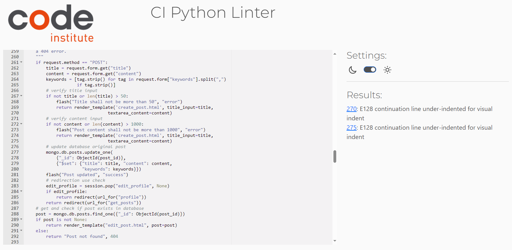
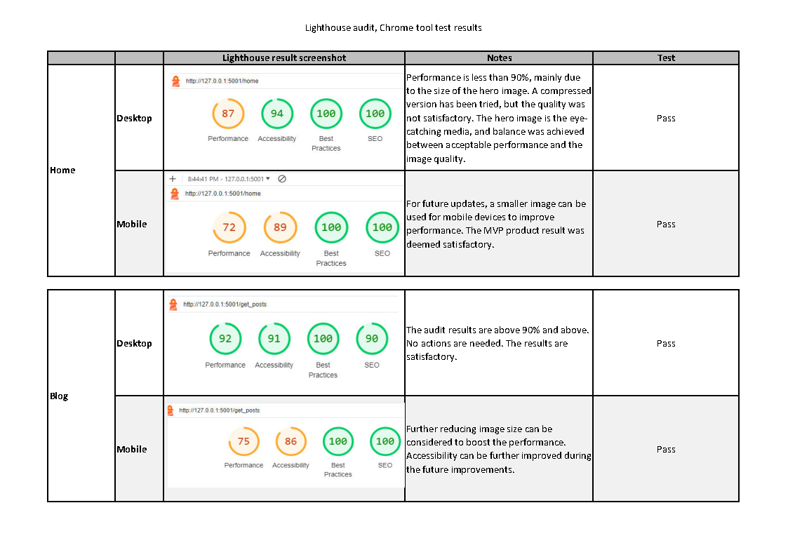

# Project Testing

[Wild Swimming link to the website](https://flask-wild-swimming-1dc7d2b9c0b6.herokuapp.com/home) 

# Table of Contents

- [Project Testing](#project-testing)
  - [Manual Testing](#manual-testing)
    - [Login Page](#login-page)
    - [Registration Page](#registration-page)
  - [Validation checks](#validation-checks)
    - [W3C HTML](#w3c-html)
    - [CSS](#css)
    - [Javascript Validation](#javascript-validation)
    - [Python Validation](#python-validation)
  - [Lighthouse validations](#lighthouse-validations)
  - [Responsivness validations](#responsivness-validations)
  - [User Story Testing](#user-story-testing)
  - [Accessibility Evaluation Summary](#accessibility-evaluation-summary)

## Manual Testing

Manual testing is crucial in website development, providing unique advantages that automated testing cannot. Human testers bring intuition, creativity, and adaptability, identifying user experience issues that may go unnoticed. Manual testing is particularly useful in exploratory testing and UI/UX evaluation. Combining manual and automated testing leads to high-quality products. 
Manual testing has been undertaken for the wild swimming website. Below is the summary of the steps and results.

### Home page
 

| Test Case | Description                                     | Steps                                                  | Expected Result                                            | Pass/Fail | Comment                                               |
|-----------|-------------------------------------------------|--------------------------------------------------------|-----------------------------------------------------------|-----------|-------------------------------------------------------|
| Navigation| Check if navigation links are working           | 1. Click on "Home" link                               | Landing on the homepage                                   | Pass      |                                                       |
|           |                                                 | 2. Click on "Blog" link                               | Redirected to the blog page                                | Pass      |                                                       |
|           |                                                 | 3. Click on "Login" link                              | Redirected to the login page                               | Pass      |                                                       |
|           |                                                 | 4. Click on "Register" link                           | Redirected to the register page                            | Pass      |                                                       |
| Homepage  | Check the content and layout of the homepage    | 1. Verify the presence of the welcome message         | "Welcome to the hub for outdoor swimmers" is displayed    | Pass      |                                                       |
|           |                                                 | 2. Verify the "Read Blog" button                      | Button is present and clickable                           | Pass      |                                                       |
| Flash Messages | Check if flash messages are displayed      | - No specific steps, just observe the flash messages   | Flash messages (if any) are displayed                      | Pass      | No messages displayed as expected                                                       |
| Footer    | Check the content and layout of the footer      | - No specific steps, just observe the footer           | Footer contains the helper message                         | Pass      |                                                       |
| Responsive| Check if the page is responsive                 | - Resize the browser window                           | Page content adjusts appropriately for different screen sizes | Pass  |                                                       |
| Accessibility| Check if the page is accessible               | - Use a screen reader     | No accessibility issues are reported                        | Pass  |                                                       |

### Blog page - user not logged in
 

| Test Case | Description                                     | Steps                                                  | Expected Result                                            | Pass/Fail | Comment                                               |
|-----------|-------------------------------------------------|--------------------------------------------------------|-----------------------------------------------------------|-----------|-------------------------------------------------------|
| Navigation| Check if navigation links are working           | 1. Click on "Home" link                               | Landing on the homepage                                   | Pass      |                                                       |
|           |                                                 | 2. Click on "Blog" link                               | Stay on the blog page                                     | Pass      |                                                       |
|           |                                                 | 3. Click on "Login" link                            | Redirected to the login page                            | Pass      |                                                       |
|           |                                                 | 4. Click on "Register" link                        | Redirected to the register page                        | Pass      |                                                       |
| Homepage  | Check the content and layout of the homepage    | - No specific steps, observe the layout and content   | Content is displayed properly, no visual issues           | Pass      |                                                       |
| Flash Messages | Check if flash messages are displayed      | - No specific steps, just observe the flash messages   | Flash messages (if any) are displayed                      | Pass      | Message prompt to login displayed when clicked on "Write Post" button                                                       |
| Blog Posts | Check if blog posts are displayed correctly   | - Verify the content of each blog post                 | Blog posts are displayed with correct information         | Pass      |                                                       |
| Search Functionality | Check if the search functionality works  | 1. Enter a valid search query in the search bar        | Relevant blog posts are displayed based on the search query | Pass  |                                                       |
|           |                                                 | 2. Click on "Reset" button                            | Reset the search and show all blog posts                  | Pass      |                                                       |
| Responsive| Check if the page is responsive                 | - Resize the browser window                           | Page content adjusts appropriately for different screen sizes | Pass  |                                                       |
| Accessibility| Check if the page is accessible               | - Use a screen reader  | No accessibility issues are reported                        | Pass  |                                                       |

### Blog page - user logged in
 

| Test Case | Description                                     | Steps                                                  | Expected Result                                            | Pass/Fail | Comment                                               |
|-----------|-------------------------------------------------|--------------------------------------------------------|-----------------------------------------------------------|-----------|-------------------------------------------------------|
| Navigation| Check if navigation links are working           | 1. Click on "Home" link                               | Landing on the homepage                                   | Pass      |                                                       |
|           |                                                 | 2. Click on "Blog" link                               | Stay on the blog page                                     | Pass      |                                                       |
|           |                                                 | 3. Click on "Profile" link                            | Redirected to the profile page                            | Pass      |                                                       |
|           |                                                 | 4. Click on "Create Post" link                        | Redirected to the create post page                        | Pass      |                                                       |
|           |                                                 | 5. Click on "Logout" link                             | Perform logout and redirect to the homepage              | Pass      |                                                       |
| Homepage  | Check the content and layout of the homepage    | - No specific steps, observe the layout and content   | Content is displayed properly, no visual issues           | Pass      |                                                       |
| Flash Messages | Check if flash messages are displayed      | - No specific steps, just observe the flash messages   | Flash messages (if any) are displayed                      | Pass      | No messages displayed as expected                                                      |
| Blog Posts | Check if blog posts are displayed correctly   | - Verify the content of each blog post                 | Blog posts are displayed with correct information         | Pass      |                                                       |
| Search Functionality | Check if the search functionality works  | 1. Enter a valid search query in the search bar        | Relevant blog posts are displayed based on the search query | Pass  |                                                       |
|           |                                                 | 2. Click on "Reset" button                            | Reset the search and show all blog posts                  | Pass      |                                                       |
| Post Actions | Check if edit and delete actions work       | 1. Click on "Edit" for a post                         | Redirected to the edit post page                           | Pass      |                                                       |
|           |                                                 | 2. Click on "Delete" for a post                       | Modal appears asking for confirmation to delete the post  | Pass      |                                                       |
|           |                                                 | 3. Confirm deletion in the modal                     | Post is deleted, and user is redirected to blog page      | Pass      |                                                       |
| Responsive| Check if the page is responsive                 | - Resize the browser window                           | Page content adjusts appropriately for different screen sizes | Pass  |                                                       |
| Accessibility| Check if the page is accessible               | - Use a screen reader  | No accessibility issues are reported                        | Pass  |                                                       |

### Profile page
 

| Test Case | Description                                        | Steps                                                               | Expected Result                                               | Pass/Fail | Comment                                                |
|-----------|----------------------------------------------------|---------------------------------------------------------------------|--------------------------------------------------------------|-----------|--------------------------------------------------------|
| Navigation| Check if navigation links are working              | 1. Click on "Home" link                                            | Landing on the homepage                                      | Pass      |                                                        |
|           |                                                    | 2. Click on "Profile" link                                         | Stay on the profile page                                     | Pass      |                                                        |
|           |                                                    | 3. Click on "Delete" button inside the modal for a post            | Confirm deletion and redirect to blog page                  | Pass      |                                                        |
|           |                                                    | 4. Click on "Edit" button inside the modal for a post              | Redirect to the edit profile page                            | Pass      |                                                        |
| Profile   | Check if the user's profile information is displayed| - Observe the content in the "Hello and welcome Al!" and "Your posts:" sections | User's name and post information are displayed correctly   | Pass      |                                                        |
| Blog Posts| Check if user's blog posts are displayed correctly | - Verify the content of each user's blog post                      | User's blog posts are displayed with correct information    | Pass      |                                                        |
| Delete Post| Check if the delete post modal works              | 1. Click on "Delete" button for a post                             | Modal appears asking for confirmation to delete the post    | Pass      |                                                        |
|           |                                                    | 2. Confirm deletion in the modal                                   | Post is deleted, and user is redirected to the blog page    | Fail      | Post deleted but user was redirected to Blog Page                                                       |
|           |                                                    | 3. Cancel deletion in the modal                                   | User is redirected to the Profile page    | Fail      | User redirected to Blog Page                                                       |
| Edit Post | Check if the edit post functionality works        | 1. Click on "Edit" button for a post                               | Redirect to the edit profile page                            | Pass      |                                                        |
| Responsive| Check if the page is responsive                    | - Resize the browser window                                        | Page content adjusts appropriately for different screen sizes | Pass  |                                                        |
| Accessibility| Check if the page is accessible                  | - Use a screen reader              | No accessibility issues are reported                         | Pass      |                                                        |

### Create Post Page
 

| Test Case | Description                                        | Steps                                                               | Expected Result                                               | Pass/Fail | Comment                                                |
|-----------|----------------------------------------------------|---------------------------------------------------------------------|--------------------------------------------------------------|-----------|--------------------------------------------------------|
| Navigation| Check if navigation links are working              | 1. Click on "Home" link                                            | Landing on the homepage                                      | Pass      |                                                        |
|           |                                                    | 2. Click on "Blog" link                                           | Redirect to the blog page                                    | Pass      |                                                        |
|           |                                                    | 3. Click on "Profile" link                                        | Redirect to the profile page                                 | Pass      |                                                        |
|           |                                                    | 4. Click on "Logout" link                                         | Log out the user and redirect to the homepage               | Pass      |                                                        |
| Create Post| Check if the create post form works                | 1. Fill in the form with valid data                               | Form fields are populated with the entered data             | Pass      |                                                        |
|           |                                                    | 2. Submit the form                                                | Post is created, and user is redirected to the blog page    | Pass      |                                                        |
|           |                                                    | 3. Leave any required field blank and submit                    | Error message is displayed, and form is not submitted       | Pass      |                                                        |
|           |                                                    | 4. Enter data that exceeds maximum length and submit            | Error message is displayed, and form is not submitted       | Pass      |                                                        |
|           |                                                    | 5. Verify character limits for title, content, and keywords     | Limits are enforced, and appropriate messages are displayed  | Pass      |                                                        |
|           |                                                    | 6. Verify the presence of cancel and submit buttons             | Both buttons are visible and functional                     | Pass      |                                                        |
| Responsive| Check if the page is responsive                    | - Resize the browser window                                        | Page content adjusts appropriately for different screen sizes | Pass  |                                                        |
| Accessibility| Check if the page is accessible                  | - Use a screen reader              | No accessibility issues are reported                         | Pass      |                                                        |

### Edit Post Page
 

| Test Case | Description                                       | Steps                                                                | Expected Result                                                | Pass/Fail | Comment                                             |
|-----------|---------------------------------------------------|----------------------------------------------------------------------|---------------------------------------------------------------|-----------|-----------------------------------------------------|
| Edit Post | Check if the edit post form works                 | 1. Open the edit post page for an existing post                       | Form is populated with post data                               | Pass      |                                                     |
|           |                                                   | 2. Modify the title, content, and tags                               | Changes are reflected in the form fields                        | Pass      |                                                     |
|           |                                                   | 3. Submit the form                                                   | Post is updated, and user is redirected to the blog page       | Pass      |                                                     |
|           |                                                   | 4. Leave any required field blank and submit                       | Error message is displayed, and form is not submitted          | Pass      |                                                     |
|           |                                                   | 5. Enter data that exceeds maximum length and submit               | Error message is displayed, and form is not submitted          | Pass      |                                                     |
|           |                                                   | 6. Verify character limits for title, content, and keywords        | Limits are enforced, and appropriate messages are displayed     | Pass      |                                                     |
|           |                                                   | 7. Verify the presence of "Cancel editing" and "Update post" buttons | Both buttons are visible and functional                       | Pass      |                                                     |
| Responsive| Check if the page is responsive                   | - Resize the browser window                                          | Page content adjusts appropriately for different screen sizes | Pass      |                                                     |
| Accessibility| Check if the page is accessible                 | - Use a screen reader                | No accessibility issues are reported                          | Pass      |                                                     |

### Login Page
 

| Test Case | Description                        | Steps                                       | Expected Result                              | Pass/Fail | Comment                        |
|-----------|------------------------------------|---------------------------------------------|----------------------------------------------|-----------|--------------------------------|
| Log In    | Check if the login form works       | 1. Open the login page                      | Form is displayed with username and password fields | Pass      |                                |
|           |                                    | 2. Enter valid username and password      | User is redirected to the home or profile page (depending on the application) | Pass      |                                |
|           |                                    | 3. Leave either username or password blank and submit | Error message is displayed, and form is not submitted | Pass      |                                |
|           |                                    | 4. Enter an invalid username or password and submit | Error message is displayed, and form is not submitted | Pass      |                                |
| Responsive| Check if the page is responsive    | - Resize the browser window                 | Page content adjusts appropriately for different screen sizes | Pass      |                                |
| Accessibility| Check if the page is accessible  | - Use a screen reader | No accessibility issues are reported       | Pass      |                                |
| Registration| Check if the "Create Account" link works | 1. Click on the "Create Account" link   | User is redirected to the registration page | Pass      |                                |
|           |                                    | 2. Verify the presence of the registration form | Registration form is displayed               | Pass      |                                |

### Registration Page
 

| Test Case | Description                        | Steps                                       | Expected Result                              | Pass/Fail | Comment                        |
|-----------|------------------------------------|---------------------------------------------|----------------------------------------------|-----------|--------------------------------|
| Register  | Check if the registration form works | 1. Open the registration page              | Form is displayed with username and password fields | Pass      |                                |
|           |                                    | 2. Enter valid username and password      | User gets registred and is redirected to the login page | Pass      |                                |
|           |                                    | 3. Leave either username or password blank and submit | Error message is displayed, and form is not submitted | Pass      |                                |
|           |                                    | 4. Enter an invalid username or password and submit | Error message is displayed, and form is not submitted | Pass      |                                |
|           |                                    | 5. Enter existing username and submit | Error message is displayed, and form is not submitted | Pass      | A flash message is displayed, prompting the user to choose another username.                                 |
| Responsive| Check if the page is responsive    | - Resize the browser window                 | Page content adjusts appropriately for different screen sizes | Pass      |                                |
| Accessibility| Check if the page is accessible  | - Use a screen reader | No accessibility issues are reported       | Pass      |                                |
| Log In Link| Check if the "Log In" link works   | 1. Click on the "Log In" link               | User is redirected to the login page        | Pass      |                                |
|           |                                    | 2. Verify the presence of the login form    | Login form is displayed                      | Pass      |                                |

## Validation checks
### W3C HTML
[W3C HTML Validator](https://validator.w3.org/nu/) has been used to test HTML. The website has no errors. 
 

### CSS
[W3C CSS Validator](https://jigsaw.w3.org/css-validator/) has been used to test Cascading Style Sheets. The website has no errors. The file that has been checked is [style.css](/static/css/style.css).
 

### Javascript Validation
[ JSHint](https://jshint.com/) has been used to test javascript. The website has no errors. The file that has been checked is [script.js](/static/js/script.js).
 

### Python Validation
[ CI Python linter](https://pep8ci.herokuapp.com/) has been used to the javascript. The website has no errors. The file that has been checked is [app.py](/app.py).
 

## Lighthouse validations

## Responsivness validations
The objective of this responsiveness test was to evaluate the website's performance and user interface across two distinct screen sizes – 1300px and 320px. The goal was to ensure that the website provides an optimal user experience on both larger desktop screens and smaller mobile screens.

Desktop (1300px):
Used Chomre DevOps browser developer tools to simulate a mobile screen with a width of 1300px.
Verified that all elements, including navigation menus, images, and text, are well-organized and proportionate.
Confirmed that the website layout scales appropriately, and content remains readable without horizontal scrolling.
Tested various pages, ensuring that all features and functionalities are accessible and perform as expected.

Mobile (320px):
Used Chomre DevOps browser developer tools to simulate a mobile screen with a width of 320px.
Checked the responsiveness of the website by confirming that the layout adjusts gracefully to the smaller screen.
Verified that navigation menus are accessible and user-friendly on mobile devices.
Ensured that images are appropriately resized and that text remains legible without requiring zooming.
Tested touch interactions, such as buttons and links, to ensure they respond effectively.
Checked for any overlapping or cut-off content on smaller screen

### Screen Size: 1300px

| Website Page         | Home | Blog | Profile | Create Post | Edit Post (Form Check) | Login | Register |
|----------------------|------|------|---------|-------------|-------------------------|-------|----------|
| Text Clarity         | Ok   | Ok   | Ok      | Ok          | Ok                      | Ok    | Ok       |
| Check Images Layout  | Ok   | Ok   | Ok      | Ok          | Ok                      | Ok    | Ok       |
| Rendering            | Ok   | Ok   | Ok      | Ok          | Ok                      | Ok    | Ok       |

### Screen Size: 320px

| Website Page         | Home | Blog | Profile | Create Post | Edit Post (Form Check) | Login | Register |
|----------------------|------|------|---------|-------------|-------------------------|-------|----------|
| Text Clarity         | Ok   | Ok   | Ok      | Ok          | Ok                      | Ok    | Ok       |
| Check Images Layout  | Ok   | Ok   | Ok      | Ok          | Ok                      | Ok    | Ok       |
| Rendering            | Ok   | Ok   | Ok      | Ok          | Ok                      | Ok    | Ok       |

### Some examples for test setup

 

## User Story Testing
As discussed in the [README Agile Development section](readme.md#AgileDevelopment), MVP focused on the Must-Have items only. Below is the test summary of all user stories. 
 

| User Story | Priority Label | Test | Comments |
|------------|-----------------|------|----------|
| As a first-time visitor, I want to see a list of available blogs on the platform to explore content. | Must-have | Pass | Site visitors can navigate to the blog page and see all available posts. The posts are displayed with the latest first. Search is added for users to filter posts. |
| As a first-time visitor, I want to read full blog posts to understand their content and the topics covered. | Must-have | Pass | All blog posts are available for site visitors. The post contains the Title, main content, keywords, author details, and the date of the post. |
| As a first-time visitor, If I find the platform interesting, I want an easy and intuitive process to register for an account. | Must-have | Pass | Users can access the registration page easily via the provided link, and the form guides them through creating an account with fields for username and password. |
| As a first-time visitor, I want to learn about the concept of wild swimming and its significance within the community. | Should-have | N/A | Not applicable to the MVP |
| As a first-time visitor, I want information about various wild swimming spots—such as rivers, lakes, or coastlines—and their suitability for swimming. | Should-have | N/A | Not applicable to the MVP |
| As a first-time visitor, I need access to safety tips, guidelines, or resources related to wild swimming to ensure a secure and enjoyable experience. | Should-have | N/A | Not applicable to the MVP |
| As a first-time visitor, I want to know how to connect with the wild swimming community - be it through forums, groups, or events - to learn more and interact with fellow enthusiasts. | Should-have | N/A | Not applicable to the MVP |
| As a first-time visitor, provide resources like recommended gear, techniques, or articles specific to wild swimming for beginners. | Should-have | N/A | Not applicable to the MVP |
| As a registered user, I want to engage in discussions, share experiences, or ask questions in forums or dedicated community spaces. | Should-have | N/A | Not applicable to the MVP |
| As a registered user, I want to log into my account securely using my credentials. | Must-have | Pass | A dedicated login page prompts users to enter their credentials, username, and password. The system verifies the provided information, granting access upon successful authentication. In case of errors, appropriate messages guide users to correct their input. |
| As a registered user, I want to create new blog posts, including adding text, images, and formatting the content. | Must-have | Pass | While the current implementation allows users to initiate the blog creation process, advanced features such as image uploading and text formatting are unavailable. These enhancements are planned for subsequent development cycles. Users can still compose and submit blog posts with text content, which is accepted for MVP. |
| As a registered user, I want the ability to edit my existing blog posts to update or refine the content. | Must-have | Pass | Registered users can now modify their previously published blog posts to update and refine the content as needed. The implementation ensures an editing experience, enabling users to make text changes and add new information. |
| As a registered user, I want the option to delete my blog posts that are no longer relevant or needed. | Must-have | Pass | Registered users now have the ability to delete their previously published blog posts when necessary. A warning prompt ensures users are informed before proceeding with the deletion. Upon confirmation, the specified blog post is permanently removed from their account, providing users with control over the content they have published on the platform. |
| As a registered user, I want to see a list of the blog posts I've authored for easy access. | Must-have | Pass | All blog posts created by users appear together in the blog space along with others. However, only the posts authored by a particular user are visible on their profile page. It helps separate the global blog space from the personalized profile page, where users can view and manage their contributions exclusively. |
| As a registered user, I want to securely log out of my account to ensure privacy and security. | Must-have | Pass | Registered users now have a secure logout functionality that allows them to terminate their active sessions, ensuring the protection of their privacy and enhancing overall account security. |
| As a registered user, I want to engage in discussions, share experiences, or ask questions in forums or dedicated community spaces. | Should-have | N/A | Not applicable to the MVP |
| As a registered user, I want the ability to create and promote events like group swims or meetups to gather fellow wild swimming enthusiasts. | Could-have | N/A | Not applicable to the MVP |
| As a registered user, opportunity to connect with experienced swimmers or experts for advice or guidance on advanced techniques, safety measures, or environmental concerns. | Could-have | N/A | Not applicable to the MVP |
| As an admin, I want to review, edit, or delete user-generated content (blog posts, comments) that violate community guidelines or are inappropriate. | Must-have | Ongoing | During the project discussion, it was decided to leave out the feature at the MVP stage and focus on delivering clean and error-free functionality. The feature is proposed to be delivered in future development cycles. |
| As an admin, I want to create, update, and delete user accounts. | Should-have | N/A | Not applicable to the MVP |
| As an admin, I want to disable or suspend user accounts for policy violations or inactivity. | Should-have | N/A | Not applicable to the MVP |
| As an admin, I want access to a dashboard displaying key platform metrics, user statistics, and activity summaries. | Could-have | N/A | Not applicable to the MVP |

## Accessibility Evaluation Summary
The accessibility evaluation was conducted through the Wave tool, revealing one error and two alerts that are consistent across all pages. Notably, the materialized navigation bar, implemented in the base.html, is a common feature across all pages. The Wave tool identifies empty and redundant links within the navigation bar for the mobile device setup. Despite this, it has been deemed acceptable for the Minimum Viable Product (MVP).

